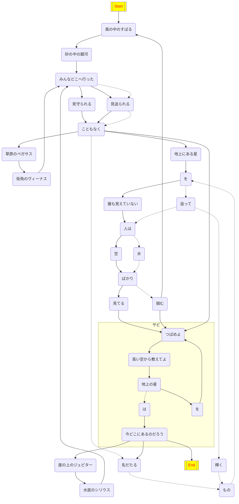

# Headline

> An awesome project.

### Mermaid

```mermaid
flowchart TD
    S[[Start]]
    kaze(風の中のすばる)
    ginga(砂の中の銀河)
    where(みんなどこへ行った)
    mio(見送られる)
    mim(見守られる)
    naku(こともなく)
    pegasus(草原のペガサス)
    vinus(街角のヴィーナス)
    sirius(水底のシリウス)
    jupiter(崖の上のジュピター)
    tijou(地上にある星)
    nadataru(名だたる)
    wo(を)
    mono(もの)
    kagayaku(輝く)
    forget(誰も覚えていない)
    otte(追って)
    hito(人は)
    sky(空)
    ice(氷)
    bakari(ばかり)
    miteru(見てる)
    tukamu(掴む)
    swallow(つばめよ)
    sorakara(高い空から教えてよ)
    hosi(地上の星)
    ha(は)
    wo2(を)
    nowhere(今どこにあるのだろう)
    E[[End]]

    S --> kaze
    kaze --> ginga
    ginga --> where
    where --> mim
    where --> mio
    where -.-> mio
    mim --> naku
    mio --> naku
    mio -.-> naku
    naku --> pegasus
    pegasus --> vinus
    vinus --> where
    naku --> tijou
    naku -.-> nadataru
    tijou --> wo
    nadataru -.-> mono
    mono -.-> wo
    wo --> forget
    wo -.-> otte
    otte -.-> kagayaku
    kagayaku -.-> mono
    forget --> hito
    otte -.-> hito
    hito --> sky
    hito -.-> ice
    sky --> bakari
    ice -.-> bakari
    bakari --> miteru
    bakari -.-> tukamu
    tukamu --> kaze
    miteru --> swallow
    tukamu --> swallow

    subgraph サビ
    swallow --> sorakara
    sorakara --> hosi
    hosi --> wo2
    wo2 --> swallow
    hosi -.-> ha
    ha --> nowhere
    end

    nowhere --> E
    nowhere --> jupiter
    nowhere --> nadataru
    jupiter --> sirius
    sirius --> where
    naku --> swallow
classDef yellow fill:yellow,color:red
class S,E yellow
```